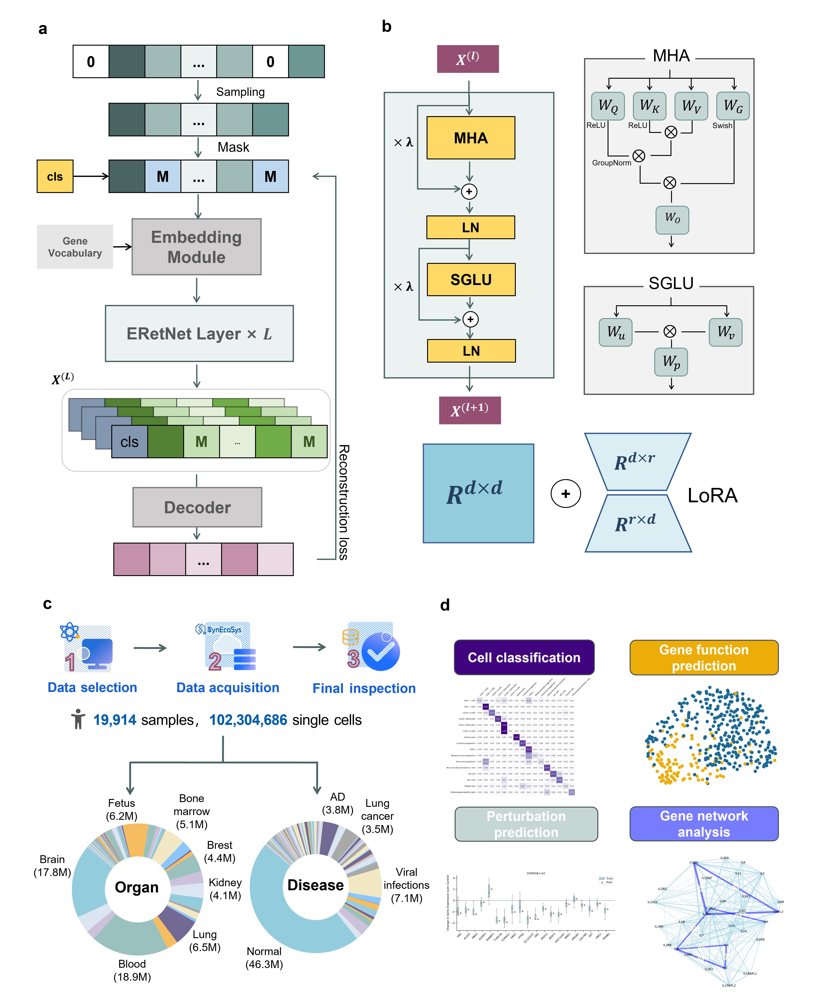

<font size=4> We propose a single-cell foundation model, CellFM.  </font> <br><br>

# CellFM

The official implementation for "**CellFM**".

**Table of Contents**

* [Datasets](#Datasets)
* [Installation](#Installation)
* [Tutorials](#Tutorials)
* [Citation](#Citation)

## Datasets


We provide easy access to the used datasets in the [synapse](https://www.synapse.org/Synapse:syn63379664/files/).


## Installation

To reproduce **CellFM**, we suggest first create a conda environment by:

~~~shell
conda create -n CellFM python=3.9
conda activate CellFM
~~~

and then install the required packages below:

- mindspore=2.2.10
- scanpy=1.10
- scib=1.1.5
### Optional
- gears
- torch

## Usage

### Data preprocessing

To run **CellFM**, we need to first preprocess the data in h5 or h5ad format. The preprocessing pipeline for different downstream tasks can refer to [process.ipynb](https://github.com/biomed-AI/CellFM/blob/main/tutorials/process.ipynb). We recommend storing the processed datasets in the [Datasets](#Datasets).

### Train on the new dataset

We provided a script [train.py](https://github.com/biomed-AI/CellFM/blob/main/train.py) for finetuning or training on new datasets. For example, we can train on the HumanPBMC dataset with a single NPU device by executing:

~~~shell
# Train with single device
python train.py --data HumanPBMC --batch 4 --epoch 5 --load_pretrain [--fp16] [--lora LORA_RANK] [--workpath /DIR/TO/WORKSPACE]
~~~

- --data: dataset name. Note that the dataset should be located in /DIR/TO/WORKSPACE/datasets with h5 or h5ad format.
- --batch: batch size.
- --epoch: the number of training epochs.
- --load_pretrain: load the pretrained weight of **CellFM**.
- --fp16: unnecessary. Set the training process under half-precision mode.
- --lora: unnecessary. Using the LoRA algorithm to update the weights using LORA_RANK as the hidden dimension of lora block, default 0 i.e. not use LoRA.
- --workpath: unnecessary when training with a single device. Set the **absolute directory** of the work path and default the directory containing codes.

We also provide a script to apply parallel training within one node. For the same example, the command below works the same as the command above except it will works on 8 devices while each device handle an input with batch size=4.

```shell
# Train parallelly in one node
bash 1node_train.sh train 4 5 HumanPBMC
```

## Tutorials

We provide tutorials for CellFM applications. Checkpoints of our model are stored in huggingface ([Model Card](https://huggingface.co/ShangguanNingyuan/CellFM) and [Pre-trained Model](https://huggingface.co/ShangguanNingyuan/CellFM/tree/main)).

### Tutorial 1: Cell Annotation

[CellAnnotation](https://github.com/biomed-AI/CellFM/blob/main/tutorials/CellAnnotation).

### Tutorial 2: Gene Function Prediction


[BinaryclassGeneFunction.ipynb](https://github.com/biomed-AI/CellFM/blob/main/tutorials/BinaryclassGeneFunction.ipynb).  
[MulticlassGeneFunction.ipynb](https://github.com/biomed-AI/CellFM/blob/main/tutorials/MulticlassGeneFunction.ipynb).

### Tutorial 3: Batch Effect Correction

[BatchIntegration.ipynb](https://github.com/biomed-AI/CellFM/blob/main/tutorials/BatchIntegration/BatchIntegration.ipynb).

### Tutorial 4: Perturbation

[GenePerturbation.ipynb](https://github.com/biomed-AI/CellFM/blob/main/tutorials/Perturbation/GenePerturbation.ipynb).

### Tutorial 5: Identifying Cell-type-specific lncRNAs 

[IdentifyingCelltypelncRNAs.ipynb](https://github.com/biomed-AI/CellFM/blob/main/tutorials/IdentifyingCelltypelncRNAs.ipynb).

## Citation

If you find our codes useful, please consider citing our work:

~~~bibtex
@article{CellFM,
  title={CellFM: a large-scale foundation model pre-trained on transcriptomics of 100 million human cells},
  author={Yuansong Zeng, Jiancong Xie, Zhuoyi Wei, Yun Su, Ningyuan Shangguan, Shuangyu Yang, Chengyang Zhang, Wenbing Li, Jinbo Zhang, Nan Fang, Hongyu Zhang, Huiying Zhao, Yutong Lu, Jue Fan, Weijiang Yu, and Yuedong Yang},
  journal={},
  year={2024},
}
~~~
